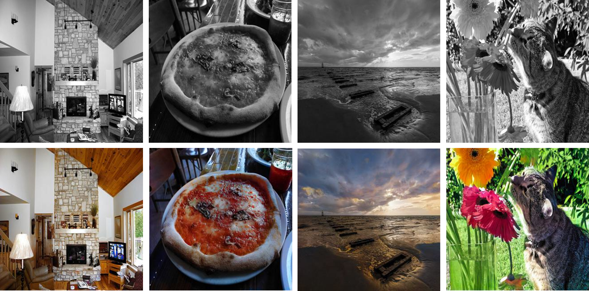

# EffiColorizer: An Efficient Image Colorization Framework for Low-Power Devices

[](https://opensource.org/licenses/MIT)


<p align="center">
  
  <em>EffiColorizer in Action — Input grayscale images (top) and their colorized outputs (bottom)</em>
  <br><br>
</p>

> **📌 Note:**  
> This repository contains a **preliminary implementation** of the framework described in our upcoming research paper: _**"Efficient Image Colorization for Low-Power Devices via Spectrally Normalized GAN with scSE Attention and EfficientNet Encoder"**_. This version serves as a **demo**, omitting components like scSE attention and employing a simplified loss function compared to the final release.


## 🔍 Overview

EffiColorizer is a lightweight, real-time image colorization framework optimized for **mobile and embedded platforms**, and implemented in **PyTorch**.  
It is useful in applications such as:
- Enhancing outputs of **night-vision IR and industrial monochromatic cameras** for visualization or downstream computer vision tasks.
- **On-device colorization** of historical photos, avoiding cloud-based processing — improving latency, cost-efficiency, and privacy.


While state-of-the-art colorization models often deliver high-quality results, they are typically **orders of magnitude larger** than what low-power or embedded systems can handle.  
EffiColorizer addresses this limitation by offering a **highly compact yet effective architecture**, capable of producing vivid and semantically accurate colorizations in real time.


## 🚀 Key Contributions (Demo Version)

- **Spectrally Normalized GAN** for stable adversarial training.
- **EfficientNet-B3 encoder integrated into U-Net generator** for high semantic understanding with minimal computational cost.
- **Novel hybrid training strategy** that alternates between joint and decoupled generator/discriminator updates.


## 🧠 Architecture Summary

- **Generator:** U-Net with EfficientNet-B3 encoder
- **Discriminator:** PatchGAN-based
- **Input Resolution:** 320×320
- **Color Space:** CIELAB (predicts a and b channels only)
- **Training Data:** 16,000 grayscale-color pairs from COCO
- **Evaluation Data:** 4,000 validation images from COCO
- **Training Epochs:** ~100


## ⚙️ Getting Started

### Clone and install dependencies

Open a terminal and run the following commands:

```bash
# Clone the repository
git clone https://github.com/aref-mousavi-eng/EffiColorizer.git

# Create a conda environment from the environment.yml file
conda env create -f environment.yml

# Check that the environment was created successfully.
# The environment 'EffiColorizer-pytorch' should appear in the list.
conda env list
```

### Training

1. Download a dataset of your choice (e.g., [COCO](https://cocodataset.org)).
2. Open the `training.ipynb` notebook.
3. Ensure that the Jupyter kernel is set to `EffiColorizer-pytorch`.
4. Update the dataset path, and execute the cells sequentially.
5. (Optional) Adjust training hyperparameters as needed.

### Evaluation

1. Download the pretrained weights from [this link](https://drive.google.com/drive/folders/1gCsAj0PQFZwtKqX3hk4UOPakIZu9l4yL?usp=sharing) and place them in the same directory as `evaluation.ipynb`.
2. Open the `evaluation.ipynb` notebook.
3. Ensure that the Jupyter kernel is set to `EffiColorizer-pytorch`.
4. Run the cells sequentially to visualize colorization results on sample images.


## 📊 Benchmark Results

We evaluate our model against the widely cited **Colorful Image Colorization (ECCV 2016)** baseline ([official repo](https://github.com/richzhang/colorization)).  
While not a state-of-the-art model, the baseline is lightweight and widely adopted, making it a practical benchmark for low-resource scenarios.

### Quality Evaluation


Image quality is evaluated using four standard metrics: FID (for perceptual realism), SSIM and PSNR (for structure and pixel-level fidelity, respectively), and LPIPS (for learned perceptual similarity).   
Among these, FID is particularly important as it strongly correlates with the visual quality of generated images.

| Model                        | FID ↓    | SSIM ↑    | PSNR ↑       | LPIPS ↓   |
|-----------------------------|----------|-----------|--------------|-----------|
| **EffiColorizer (Ours)**    | **9.29** | **0.922** | **24.93 dB** | **0.111** |
| Colorful Image Colorization | 22.50    | 0.911     | 21.21 dB     | 0.181     |

Our method achieves a **2.4× improvement** in FID compared to the baseline.


### Computational Efficiency

We compare both models in terms of FLOPs and parameter count.  
To ensure a fair comparison, we normalize FLOPs to a 256×256 input resolution, as the original input sizes differ (EffiColorizer: **320×320**, baseline: **256×256**). FLOP values are reported per image.

| Model                        | Params ↓ | FLOPs @ 256×256 ↓ |
|-----------------------------|----------|--------------------|
| **EffiColorizer (Ours)**    | **13.16 M** | **~3.87 GFLOPs**   |
| Colorful Image Colorization | 32.24 M  | 41.78 GFLOPs       |

EffiColorizer requires approximately **10.8× fewer FLOPs** and **2.4× fewer parameters** than the baseline model, while still achieving **superior performance across all quality metrics**.


## 📄 Citation

This code corresponds to a paper that is currently under preparation.  
Citation details will be provided here upon publication.

For early academic inquiries, feel free to reach out.


## ✉️ Contact

Interested in collaborating, extending this framework, or using it in your own work?  
Feel free to reach out via [GitHub Issues](https://github.com/aref-mousavi-eng/EffiColorizer/issues).  
Feedback and suggestions are welcome.